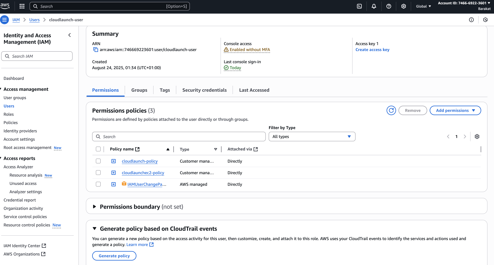
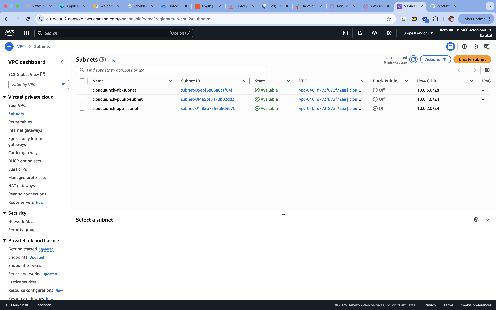

# CloudLaunch — AltSchool of Engineering 

## Project Overview
This project demonstrates how to deploy a static website on AWS S3 with proper IAM policies and design a secure VPC network environment.

It consists of:

- Hosting a public static site (cloudlaunch-site)

- Creating private/controlled access buckets

- Implementing IAM policies for restricted access

- Designing a custom VPC with subnets, route tables, and security groups

## Part 1: Static Website on S3 + IAM
### S3 Buckets Created
- **Region:** eu-west-2 (London), chosen for proximity and faster access.

- cloudlaunch-site – hosts static website (public read-only access)

- cloudlaunch-private – private storage (Get/Put only, no public access)

- cloudlaunch-visible-only – visible in the bucket list, but contents blocked

- **Steps Taken:**

1. Search for S3 in AWS Console → Create Bucket.

2. Name your bucket(s) and choose General Purpose.

3. Set Object Ownership to ACL disabled.

4. Adjust public access settings:

- cloudlaunch-site → public access allowed

- cloudlaunch-private & cloudlaunch-visible-only → block public access enabled

5. Disable versioning, keep default encryption.

### Public Website URL: [CloudLaunch Site](https://cloudlaunch-site.s3.eu-west-2.amazonaws.com/index.html)

### IAM User & Policies

- **IAM User:** `cloudlaunch-user` (password reset enforced at first login)

- **Policies Attached:**
  - `iam/s3-policy-cloudlaunch-user.json` → strict S3 access (no deletes)
  - `iam/vpc-readonly-policy-cloudlaunch-user.json` → read-only access to VPC resources

### Policies in Json `./iam/`:
- [User S3 Policy](./iam/UserS3-Policy.json)
- [User VPC Readonly Policy](./iam/UserVPC-readonly-policy.json)
- [Website Bucket Policy](./site-bucket-policy.json)

## Task 2: VPC Design

**VPC Name:** `cloudlaunch-vpc`  
**CIDR Block:** `10.0.0.0/16`

### Subnets
- `cloudlaunch-public-subnet` → `10.0.1.0/24`
- `cloudlaunch-app-subnet` → `10.0.2.0/24`
- `cloudlaunch-db-subnet` → `10.0.3.0/28`

### Internet Gateway
- IGW: `cloudlaunch-igw` (attached to VPC)

### Route Tables
- `cloudlaunch-public-rt` → `0.0.0.0/0` via IGW (associated with **Public subnet**)
- `cloudlaunch-app-rt` → private (no default route)
- `cloudlaunch-db-rt` → private (no default route)

### Security Groups
- `cloudlaunch-app-sg` → inbound TCP/80 (HTTP) from `10.0.0.0/16`

- `cloudlaunch-db-sg` → inbound TCP/3306 (MySQL) from `10.0.2.0/24`

## Console & Credentials 
- **Account ID :** `746669223601`
- **Console Sign-in URL:** [AWS Console Login](https://746669223601.signin.aws.amazon.com/console)
- **user:** `cloudlaunch-user`  
**password reset enforced**

## Summary
- 3 S3 Buckets created for different access levels 
- IAM user with restricted S3 & VPC permissions  
- VPC designed with public, app, and DB subnets  
- Secure access with proper SG rules  
